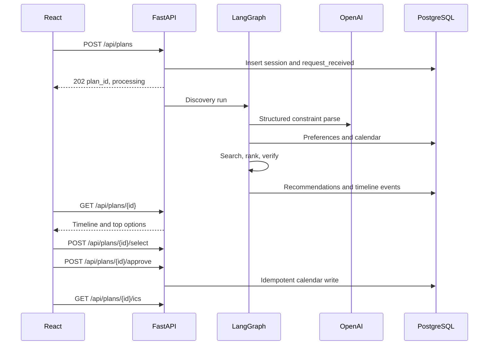
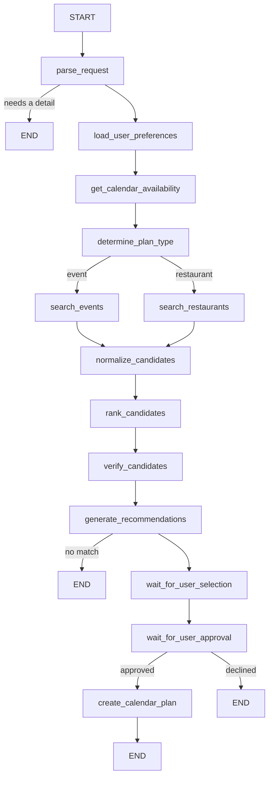
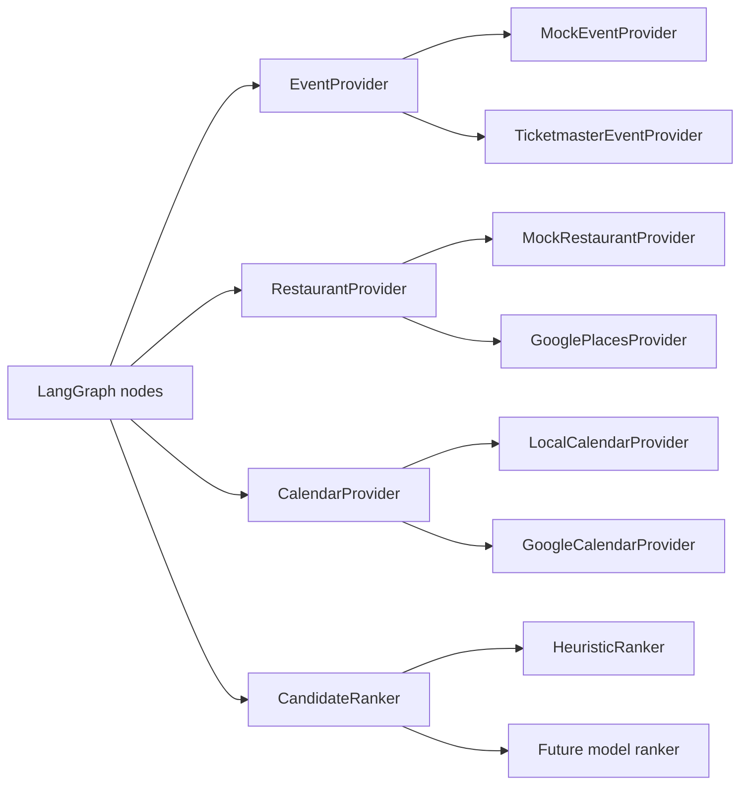

# Nemi architecture

Nemi V0 is a local planning agent. A person describes an activity or a meal, Nemi turns that into constraints, checks a local calendar, searches a provider, ranks the options with deterministic code, and waits for an explicit yes before writing a calendar event.

The V0 process is one FastAPI application, one Vite React app, and PostgreSQL. OpenAI is the only required external service. Events, restaurants, and calendar writes go through provider interfaces whose default implementations are local.

## Decisions

### One process, not a platform

Alternatives: a single FastAPI process, or separate agent, ranking, and provider services. V0 uses one process. Nothing here has a different scaling or isolation requirement, and a network hop would make the local loop harder to run. Splitting later stays possible because providers, ranking, and the workflow already have their own modules.

### Vite React client

Alternatives: the Next.js app shape described in the engineering rules, or a standalone Vite client. The V0 product requirement is a standalone React app, so the client lives in `frontend/` and talks to FastAPI over HTTP. There is no server-rendered product UI.

### PostgreSQL, single local user

Alternatives: file storage, or accounts with authentication. Planning history, preferences, calendar events, and future ranking rows need real queries and transactions, so the system of record is PostgreSQL. V0 does not authenticate. Every row belongs to one seeded local user (`local@nemi.app`). The API is meant to be bound to localhost. Adding accounts later means replacing the local-user lookup; tables already carry `user_id`.

### Human waits live in Postgres

Alternatives: pause a LangGraph thread in a graph checkpointer, or persist the plan in our tables and treat selection and approval as API transitions. V0 does both jobs with one graph definition. Discovery runs in LangGraph until recommendations exist. The paused plan is the `planning_sessions` row (`awaiting_selection`, then `awaiting_approval`). Approval calls the same calendar function the graph node calls. An in-memory checkpointer is used to prove the full interrupt path in tests. Restart survival comes from Postgres, not from process memory.

### Heuristic ranker behind a protocol

Alternatives: ask the model to order options, or score them in code. Ordering is deterministic. `CandidateRanker` is the seam a later model ranker can implement. V0 ships `HeuristicRanker` only.

### Polling

The plan request returns immediately with `status: processing`. The client polls `GET /api/plans/{id}`. WebSockets are not used.

### Interaction outbox

Behavior rows live in `interaction_events` with a dotted `topic` (`recommendation.shown`). Nothing publishes them. A later consumer can read the same rows or the same names.

## Frontend

`frontend/` is a Vite + React + TypeScript app. React Router owns screens. TanStack Query owns server state. React Hook Form and Zod own the preferences form. Components do not call `fetch` directly; they use `src/api/`.

Screens:

- New plan, the composer
- Plan workspace: timeline, three recommendations, approval, success
- Recent plans
- Preferences
- Integrations, including the local calendar
- Settings, including theme

The timeline renders labels produced by the backend from stored workflow events. It does not invent completed steps. While a plan is `processing` and the latest stored step is already complete, the workspace shows a single honest “Working on your plan” state.

Dark mode is a class on the document element. Layout is a sidebar plus a single workspace column, collapsing to a drawer below the `md` breakpoint.

## Backend

```text
backend/app/
  api/            HTTP routes, schemas at the edge, error mapping
  agents/         LangGraph graph, node functions, prompts
  core/           settings, clock, errors
  db/             engine and session
  domain/         pydantic models that are not ORM rows
  integrations/   mock providers and future stubs
  models/         SQLAlchemy tables
  providers/      protocols and factories
  repositories/   persistence
  services/       ranking, calendar rules, ICS, planning orchestration
```

Routes validate input, call a service, and return pydantic schemas. They do not score candidates or call OpenAI. Nodes call services and providers. Providers are the only place that know a mock catalog or, later, a third-party payload.

### Request path



## LangGraph workflow

One state machine. Nodes do not call each other, and there is no second agent.



`PlanningState` is a typed dictionary of JSON-serializable values. Domain objects are validated with pydantic at the node boundary.

What the model does:

- classify event vs restaurant
- extract day hints, time of day, categories, cuisines, budget phrasing, and travel limits
- write a short explanation for each recommended option

What code does:

- turn a day hint into a calendar date
- turn “under” vs “around” into a budget ceiling (`around` uses 1.2× the amount)
- fill missing budget or travel from saved preferences
- compute free windows and overlaps
- score and sort
- decide that a write is allowed

If the day or the plan type is still missing after parsing, the graph stops and the API stores one clarification question. The model is not allowed to invent that date.

Explanations are attached after sorting. A missing or failed explanation falls back to a template that uses the same facts. The template cannot change the order.

## Providers



`EVENT_PROVIDER`, `PLACE_PROVIDER`, and `CALENDAR_PROVIDER` select the implementation. `mock` and `local` are the defaults and do not call the network. `ticketmaster`, `google` places, and `google` calendar call those APIs with `httpx` when selected. A missing key or a missing Google connection fails that provider. Demo results are not substituted.

Mock catalogs are deterministic. Event dates are computed from the query’s date range and a weekday, so “Saturday” stays meaningful as the clock moves. Distances are estimates from a fixed demo neighborhood, not from device GPS.

Every provider result is converted to `Candidate` before it leaves the provider. The rest of the system never sees a vendor payload.

## Ranking

`HeuristicRanker` scores each candidate from 0 to 1:

| Component | Default weight | High score |
| --- | --- | --- |
| preference | 0.35 | category or cuisine overlap, excluding anything the person dislikes |
| schedule | 0.25 | fully inside a free window |
| distance | 0.15 | shorter travel, inside the travel limit |
| price | 0.10 | within the budget ceiling |
| quality | 0.15 | higher rating |

Weights are configuration. They must sum to 1. Ties break on candidate id.

Hard exclusions happen after scoring, in `verify_candidates`: schedule overlap, travel over the limit, or price over the ceiling. Those exclusions apply only when the calendar read succeeded. An unavailable calendar uses a neutral schedule score of 0.5 and leaves the candidate eligible. Excluded rows are stored with their scores and `shown = false`. The three shown rows are the best remaining scores. That table is the future training set: one row per considered candidate, with component scores, rank, and whether it was shown, selected, approved, scheduled, or rejected. Scores stay on the candidate row. Interaction properties carry the candidate join key, not the scores.

## Approval and calendar writes

Reads run automatically: preferences, local calendar, and mock search.

Writes that represent a commitment do not. `schedule_approved_plan` refuses to create an event unless `approved` is true. The HTTP approve action is the only production caller that passes that flag, and only after a selected candidate exists.

The idempotency key is the SHA-256 of `plan_id`, `selected_candidate_id`, and `create_event`. A second approve returns the original calendar row. A conflict check runs again at write time. A conflict does not consume the key, so the person can remove the overlapping event and approve again, or pick a different option.

User-initiated `POST /api/calendar/events` and `DELETE` are that person’s actions, not the agent’s. The agent has no delete or update path. V0 does not buy tickets or reserve tables.

Cancelling the confirmation clears the selection and writes nothing.

## Database

| Table | Role |
| --- | --- |
| `users` | The seeded local user |
| `user_preferences` | Categories, cuisines, dislikes, budget, travel, days, time ranges, optional home city, coordinates, radius, and timezone |
| `planning_sessions` | One request and its status |
| `planning_constraints` | The structured constraints for that session |
| `recommendations` | The recommendation set |
| `recommendation_candidates` | Scored candidates, including ones not shown |
| `local_calendar_events` | Local calendar, including sample events and scheduled plans |
| `calendar_actions` | Idempotent write log |
| `agent_runs` | One discovery or follow-up attempt |
| `agent_run_events` | Safe workflow events |
| `interaction_events` | Behavior rows for a later pipeline |
| `oauth_connections` | One Google Calendar connection for the local user. The refresh token is plaintext and is read only through `OAuthConnectionRepository` |
| `oauth_states` | Single-use OAuth nonces, stored as a SHA-256 hash, with an allowlisted return path |

Agent events store time, session, type, duration, status, safe metadata, and an error code. They do not store chain-of-thought or the raw model request.

## API

| Method | Path | Role |
| --- | --- | --- |
| `POST` | `/api/plans` | Start a plan. `202` with `plan_id` and `processing` |
| `GET` | `/api/plans` | Recent plans |
| `GET` | `/api/plans/{id}` | Plan, timeline, and shown recommendations |
| `GET` | `/api/plans/{id}/timeline` | Timeline only |
| `POST` | `/api/plans/{id}/clarify` | Answer the one clarification question |
| `POST` | `/api/plans/{id}/continue` | Resume the same plan after `awaiting_location` |
| `POST` | `/api/plans/{id}/reject` | Mark one shown candidate rejected |
| `POST` | `/api/plans/{id}/select` | Choose a shown candidate |
| `DELETE` | `/api/plans/{id}/selection` | Leave the confirmation step without writing |
| `POST` | `/api/plans/{id}/approve` | Approve or decline the calendar write |
| `GET` | `/api/plans/{id}/ics` | Download the `.ics` file |
| `GET` / `PUT` | `/api/preferences` | Read or replace preferences |
| `GET` / `POST` | `/api/calendar/events` | List or add a personal event |
| `POST` | `/api/calendar/sample` | Add the sample Saturday events once per date |
| `DELETE` | `/api/calendar/events/{id}` | Delete a personal event |
| `GET` | `/api/integrations` | Active providers, connection state, timezone, OpenAI configuration. No upstream probe |
| `POST` | `/api/integrations/google/calendar/connect` | Start Google Calendar OAuth |
| `GET` | `/api/integrations/google/calendar/callback` | Exchange the code and redirect to the allowlisted path |
| `DELETE` | `/api/integrations/google/calendar/disconnect` | Delete the local user's Google connection |
| `GET` | `/api/calendar/window` | Busy time from the active calendar provider |
| `GET` | `/api/interactions` | Paginated interaction events for the local user |
| `GET` | `/health` and `/health/db` | Process and database checks |

Error bodies use `{ "error": { "code", "message" } }`. The UI shows the message, not a traceback.

Dates in responses are timezone-aware ISO timestamps. The client formats them in the saved preference timezone when one is set, otherwise in the timezone reported by `/api/integrations` (`APP_TIMEZONE`, default `America/Chicago`).

## Failure behavior

| Failure | What the person sees | What is stored |
| --- | --- | --- |
| Missing or invalid model output after 3 attempts | Could not understand the requested date | `failed`, `date_unclear` or `parse_failed` |
| Model timeout | OpenAI request timed out | `failed`, `openai_timeout` |
| Provider error after retries | Search failed, with retry | `failed`, `provider_failed` |
| Nothing left after verify | No events or restaurants matched | `no_matches` |
| Selected option overlaps the calendar | Conflict message, no new event | status stays `awaiting_approval` |
| Second approve | The same event | original `calendar_actions` row |

LLM and provider calls use a timeout and a small retry budget. Database writes that belong together (the calendar event and its action row) commit in one transaction.

## Local runtime

- React: `http://127.0.0.1:5173`
- FastAPI: `http://127.0.0.1:8000`
- PostgreSQL: `localhost:5432`, via Docker Compose

The Vite dev server proxies `/api` and `/health` to FastAPI.

## Future evolution

These are boundaries, not V0 work.

- V1, in progress on this tree: Ticketmaster, Google Places, and Google Calendar behind the existing provider seam. The implementation contract is [v1-plan.md](v1-plan.md). Mock and local mode still run with no keys.
- V2: train a ranker on `recommendation_candidates` and `interaction_events`, then add another `CandidateRanker`. The heuristic remains the baseline.
- V3: publish the dotted interaction topics. Consumers can build features and training sets. Kafka is not justified before there is a real second consumer.
- V4: move Postgres, files, images, and secrets onto managed infrastructure when the app leaves one machine.
- V5: split services only when their scaling or release needs diverge.

The V0 loop to protect while doing that is unchanged: understand a request, search, check the schedule, rank, ask, then write one calendar event.
