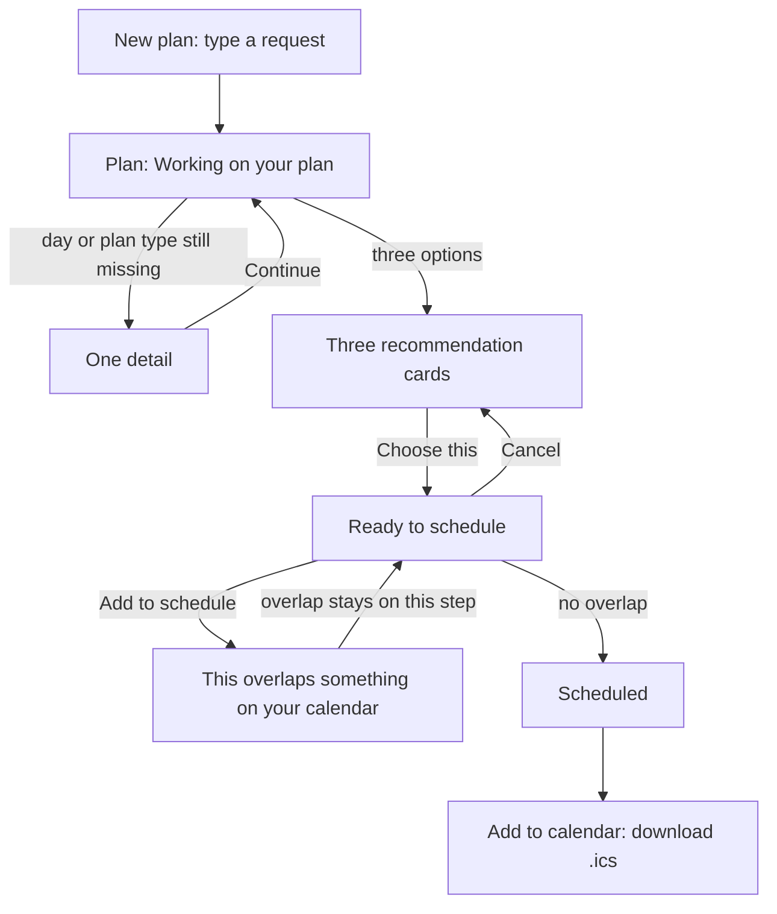
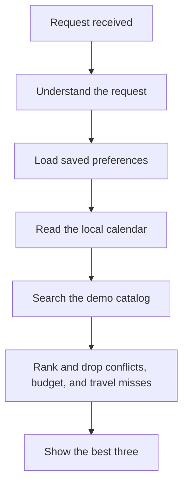

# V0 user flow

V0 is a local planning loop. The person describes an afternoon or a meal. Nemi parses that request, checks a calendar stored in Nemi, searches a demo catalog, and shows three options. Nothing is written until the person presses **Add to schedule**. The result is one local calendar event and an `.ics` file. Nemi does not call Ticketmaster, Google Places, or Google Calendar.

Restaurant reservations and ticket purchases are out of scope.

## Where the person goes

The app is one sidebar and one workspace.

| Screen | What it is for |
| --- | --- |
| New plan | Type the request |
| Plan | Watch progress, pick an option, approve the write |
| Recent plans | Open a plan again after a refresh |
| Preferences | Tastes, budget, travel minutes, days, and a usual time |
| Integrations | See that events, restaurants, and the calendar are local. Add or delete sample calendar rows |
| Settings | Light, dark, or system theme. Timezone is read-only and comes from `APP_TIMEZONE` |

## Happy path

1. On **New plan**, the person types something like “Find me something interesting to do Saturday afternoon” or “Find me a Japanese restaurant Friday after work,” then starts the plan.
2. The app opens that plan and polls while the status is processing. The timeline shows only steps the backend has stored. If the latest stored step is already finished, the page says **Working on your plan**.
3. If the day or the kind of plan is still missing, the page asks **One detail**. Continue sends that answer on the same plan. Nemi does not invent the date.
4. The workspace shows up to three cards: title, time, price, travel, a short reason, and **Choose this**. **View details** appears only when the option has a link.
5. **Ready to schedule** shows the chosen title, time, travel estimate, and either **No conflicts detected.** or **This overlaps something on your calendar.**
6. **Cancel** returns to the three cards and writes nothing. **Add to schedule** writes one local event. A second approval returns that same event.
7. **Scheduled** offers **Add to calendar**. The file opens in Google Calendar, Apple Calendar, or Outlook. That download is the way a V0 event leaves Nemi. Nemi itself does not create a Google event.

Recent plans lists the request and status. Opening a row returns to the same plan.

## What Nemi does while the page says it is working

The person does not operate these steps. The timeline is the visible trace.

OpenAI classifies event versus restaurant, pulls out the day, time of day, categories or cuisines, and budget wording, then writes the short reason on each card. Dates, budget ceilings, free time, scores, and the decision to write a calendar event are code. A missing or failed explanation falls back to a sentence built from the same facts. The fallback cannot change the order.

Demo events sit in a fixed Chicago neighborhood. Distances are estimates from that neighborhood, not from the person’s phone.

## Other endings

| What happened | What the person sees | What was written |
| --- | --- | --- |
| OpenAI cannot find a date, or is not configured | The plan fails with that message. **Try again** starts a new plan from the same text | No calendar event |
| Nothing survives the filters | **Nothing to schedule yet** | No calendar event |
| The chosen time overlaps the calendar | The approval panel stays open with the overlap sentence | No calendar event. Approving again is allowed after the overlap is gone |
| The person leaves the approval step | The three cards return | No calendar event |
| The person declines the write | **Plan cancelled**. Nothing was added to the calendar | No calendar event |

## Integrations in V0

Integrations reports the demo event catalog, the demo restaurant catalog, and the local calendar as ready. OpenAI is **Configured** or **Not configured**. The page never shows a key.

**Add sample Saturday** inserts a gym block and a dinner on that date, once. Those rows are the busy time Nemi checks. Delete removes a personal row. There is no Connect button.
