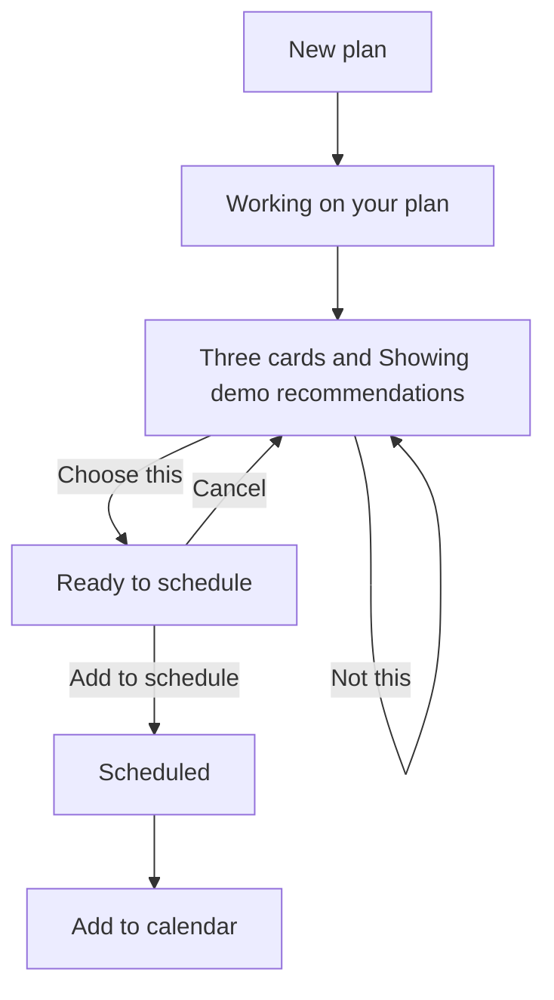
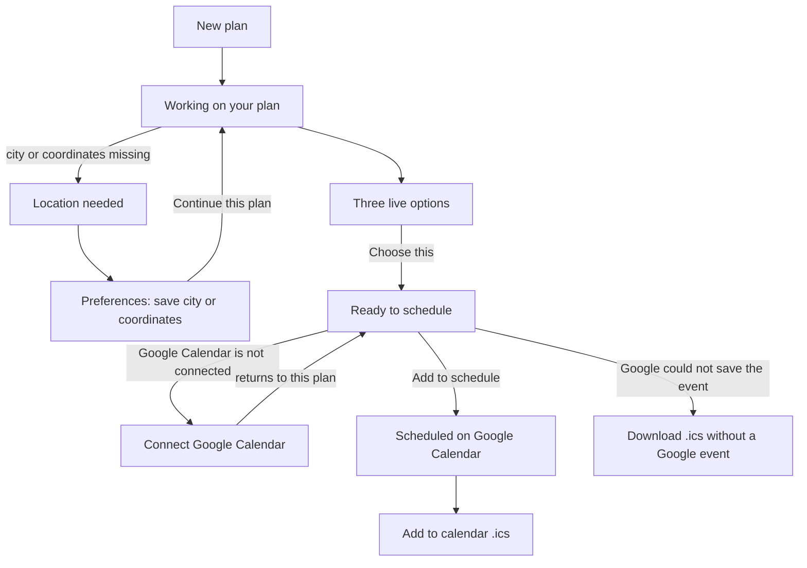
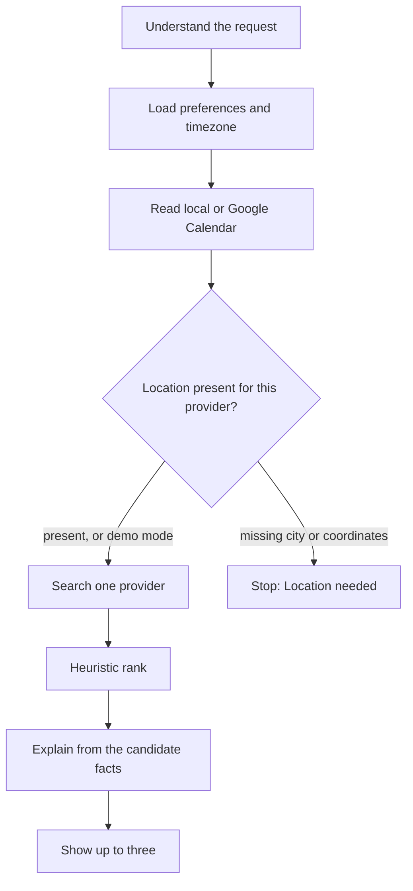

# V1 user flow

V1 keeps the V0 planning loop and replaces the demo world when credentials are configured. The same screens search Ticketmaster, search Google Places, read the person’s Google Calendar, and, after an explicit yes, create one Google event. With no keys, the app still shows demo recommendations and the local calendar.

This checkout is still on the demo settings until `.env` selects a real provider. Setup is [integrations.md](../integrations.md). Restaurant reservations and ticket purchases stay out of scope.

## What changed for the person

| Moment | V0 | V1 |
| --- | --- | --- |
| Events | Demo catalog | Ticketmaster when `EVENT_PROVIDER=ticketmaster`, otherwise the demo catalog |
| Restaurants | Demo catalog | Google Places when `PLACE_PROVIDER=google`, otherwise the demo catalog |
| Busy time | Rows stored in Nemi | Google Calendar when `CALENDAR_PROVIDER=google`, otherwise the local notebook |
| After approval | One local event, plus `.ics` | One Google event when connected. `.ics` remains, including when Google could not save the event |
| Location | None. Demo distances use a Chicago neighborhood | Home city, coordinates, radius, and timezone in Preferences |
| A card the person does not want | Leave it unchosen | **Not this** rejects that one card |
| Calendar not connected | Not a state | The plan stays open and offers **Connect** |

## Where the person goes

The routes are unchanged: New plan, Plan, Recent plans, Preferences, Integrations, and Settings.

Preferences now includes home city, latitude, longitude, default search radius, and timezone. Empty city and coordinates stay empty. Settings no longer asks the person to edit `APP_TIMEZONE`. It links to Preferences.

## Happy path, demo mode

This is the path the app takes with the default `.env`: mock events, mock restaurants, local calendar.

**Not this** marks only that card. The other two stay available. **Choose this** still leads to approval. **Cancel** on the approval panel returns to the cards and writes nothing.

## Happy path, real providers

1. The person writes the same kind of request as in V0.
2. While the plan is processing, Nemi reads the configured calendar. A Google read that fails does not stop the search. Cards can still appear, and the copy says **Schedule was not checked.** The timeline says the calendar could not be checked and that conflicts were not checked. It does not say the slot is free.
3. **Location needed** appears on that same plan when Ticketmaster is selected and no home city is saved, or when Google Places is selected and latitude or longitude is missing. Demo providers skip this step. Nemi does not turn a city name into coordinates.
4. The person saves the missing fact in Preferences and presses **Continue this plan**. Discovery runs again on the same plan. Event search can proceed with a city and no coordinates. Restaurant search does not call Places until both coordinates exist.
5. Live results have no “Showing demo recommendations.” line. Each card still uses **View details** for the source link. Ticket prices show in dollars. A Places ranking band shows as `$` or `$$`, not as a menu price.
6. **Add to schedule** reads the calendar again, checks overlap in code, and creates one event. Approving twice does not create a second event.
7. **Scheduled** still offers the `.ics` download. If Google accepted the event, it is also on the connected calendar. If the create failed, the plan stays on the approval step and offers **Download .ics**. The page does not say Scheduled.

Connect from a plan returns to that plan. Connect from Integrations returns to Integrations. The browser cannot choose another site.

## What Nemi does while the page says it is working

One search uses one provider. A Ticketmaster or Places failure ends the plan with a message that demo results were not substituted. The three cards are not a mix of demo and live options.

Conflict detection stays in code. The model does not decide whether two events overlap, and it does not create the calendar event. Explanations may repeat price, distance, rating, time, and venue only when those values are on the option. A sentence that invents one of them is replaced by a template.

## Approval outcomes

| What happened | What the person sees | Calendar write |
| --- | --- | --- |
| Local calendar, no overlap | **Scheduled**, then **Add to calendar** | One local event |
| Google connected, no overlap | **Scheduled**, then **Add to calendar** | One Google event. The same approval again returns that event |
| Overlap | **This overlaps something on your calendar.** The step stays open | None. The person can change the calendar or pick another option |
| Google Calendar not connected | **Connect**, with the three cards still on the plan | None, until Connect succeeds and the person approves |
| Google create failed, or the calendar could not be re-read | **Download .ics** on the approval step | None on Google |
| **Not this** | That card is rejected. The others remain | None |
| **Cancel** | Back to the three cards | None |

## Integrations

The page reads status from Nemi. It does not call Ticketmaster, Places, or Google on each visit.

| Row | Demo settings | Real settings |
| --- | --- | --- |
| Events | Mock | Ticketmaster **Configured**, or **Not configured** if the key is missing |
| Restaurants | Mock | Google Places **Configured**, or **Not configured** |
| Calendar | Local notebook, sample Saturday, delete | **Not connected** and **Connect**, or **Connected** and **Disconnect**. No email is shown |
| OpenAI | **Configured** or **Not configured**. The key is never shown | Same |

The local notebook stays on the page when Google Calendar is the busy calendar. Those sample rows are not Google’s events.

Disconnect removes Nemi’s copy of the connection. It does not, in this version, revoke the grant at Google.

## What is recorded

Each shown option, **Choose this**, **Not this**, and a successful schedule leaves an interaction row. Those rows are separate from the timeline. They are the later training set. Scores stay on the recommendation, not in the interaction payload.
