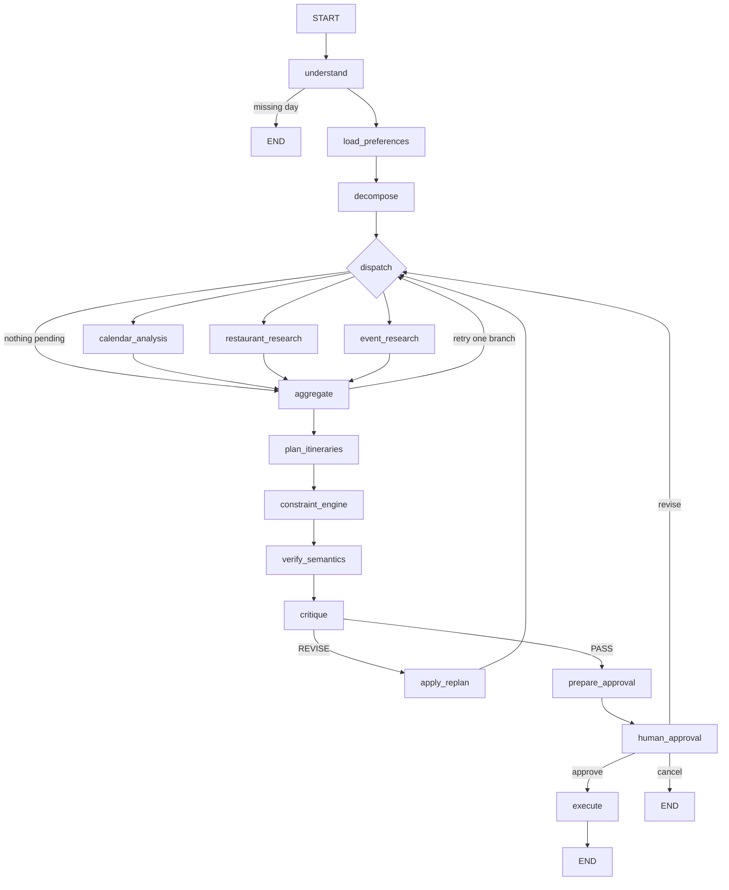

# Multi-agent architecture

V2 adds a root LangGraph for multi-part evenings. Single-activity plans still use the graph in `backend/app/agents/graph.py`. The split is deliberate: that API selects one candidate and writes one event, and that behavior stays.

## What each agent owns

Agents do not talk in free text. Each one has a job, a narrow input, a tool allow-list, and a pydantic output.

| Agent | Owns | Reads | Tools | Writes |
| --- | --- | --- | --- | --- |
| Supervisor | Task list, dependencies, retry or replan decision | Request, constraints, task statuses | None | `AgentTask` updates |
| Calendar analysis | Free windows and hard time bounds | Constraints, calendar events | `google_calendar.list_events`, `calendar.find_free_windows` | `CalendarAnalysisResult` |
| Restaurant research | Cuisine, diet, budget, and travel filtering | Constraints, rejected ids | `search_restaurants` | `RestaurantResearchArtifact` |
| Event research | Time-compatible activities | Constraints, rejected ids | `search_events` | `EventResearchArtifact` |
| Itinerary planner | Complete candidate evenings | The three artifacts and constraints | None | `list[Itinerary]` |
| Constraint engine | Hard rules | Itineraries and calendar windows | None | Violations and checks |
| Verifier | Whether the plan covers the request | Itinerary, constraints, artifacts | None | `SemanticReview` |
| Critic | Preference and claim problems | Top itinerary, constraints, research | None | `CriticResult` (`PASS` or `REVISE`) |
| Execution | Calendar writes | Approved itinerary id | `google_calendar.create_event`, and `calendar.delete_event` only after a confirmed cancel | `ExecutionReport` |

The constraint engine is not a model. Overlap checks use `overlaps` and `contained` in `backend/app/services/calendar/conflicts.py`.

Search may call more than one provider with `asyncio.gather`, then normalize and dedupe on external id and start time. V2 ships with the single configured provider. Extra providers are a list on the graph dependencies so a second source does not require a new graph.

## Root graph

`dispatch` is a conditional edge, not an agent. It sends one `Send` per pending research task whose dependencies are complete. Independent tasks run in the same superstep. `aggregate` is the fan-in.

Shared channels that parallel nodes append to use reducers: `tasks` merge by `task_id`, and `errors`, `trace_events`, and `branch_reports` concatenate. A node returns only its own task. It does not replace the whole task list.

## Dynamic routing

`decompose_tasks` builds the task list from the request.

- Dinner only: calendar and restaurant. No event task.
- An activity only: calendar and events. No restaurant task.
- Date night, “after dinner”, or “afternoon and evening”: all three research tasks, then itinerary generation that depends on them.

The orchestrator only enters this graph when `is_itinerary_request` is true (date night, after dinner, a meal plus an outing, or afternoon and evening). Dinner-only and activity-only routing is still unit-tested on `decompose_tasks`. Those sentences keep using the single-activity graph so selection and approval stay as they are.

## State

`RootPlanningState` holds the request, constraints, tasks, one artifact slot per specialist, itineraries, verification, critic result, approval, replan count, and errors. Specialist nodes read the constraint object and their own inputs. They do not put restaurant copy into the calendar prompt, because the calendar node does not call a model.

Checkpoint thread id is the plan id. Resume uses `Command(resume=...)` on that thread.

## Models and prompts

`SUPERVISOR_MODEL`, `RESEARCH_MODEL`, `PLANNER_MODEL`, and `CRITIC_MODEL` override `OPENAI_MODEL` when set. The V2 coordination policy is deterministic and records `model=deterministic` plus a policy version (`supervisor_policy_v1`, `restaurant_research_v1`, `event_research_v1`, `itinerary_planner_v1`, `verifier_v1`, `critic_v1`). Prompt text for a later model call lives in `backend/app/agents/itinerary/prompts.py`. Structured output that fails validation is retried up to three times (`PLANNER_INVALID_OUTPUT` exercises this). Chain-of-thought is not stored.

## Limits

| Setting | Default | When exceeded |
| --- | --- | --- |
| `MAX_REPLAN_ATTEMPTS` | 3 | Stop with the best remaining itinerary or a limiting-constraint message |
| `MAX_SUPERVISOR_STEPS` | 20 | Same stop |
| `MAX_TOOL_CALLS_PER_AGENT` | 10 | That agent fails its task |
| `MAX_TOTAL_LLM_CALLS` | 12 | Further model calls are refused |
| `SPECIALIST_TIMEOUT_SECONDS` | 25 | That branch fails; others can still join |

A failed branch does not fail the graph. The supervisor retries a retryable branch once, otherwise the planner continues with whatever artifacts exist.

## Observability

Each agent span stores start, end, latency, status, model, token counts, estimated cost, tool names, retry count, and a safe error code. The plan payload exposes that list. The consumer checklist shows status and a short detail. Token totals and cost sit in the collapsed developer trace.

Parallel speedup is `sum(branch durations) / join wall clock` for that research wave. The fan-out test asserts the ratio is greater than 1.

## Where a future memory agent would sit

A memory specialist would be another research task with its own artifact slot and no write tools. The planner would gain one more optional input. That agent is not part of V2.
