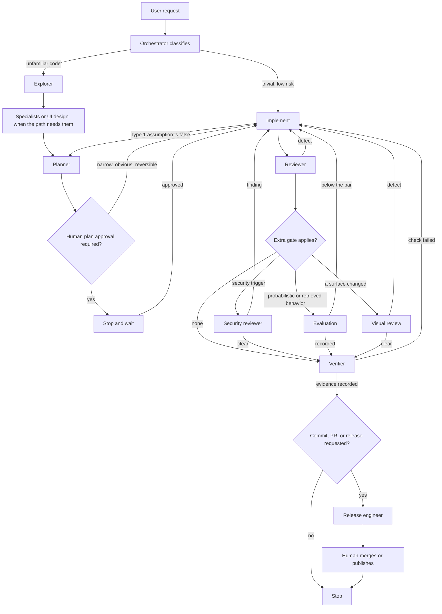

# Agentic coding workflow

This is how Cursor agents change this repository. It is not the Nemi product. The product planning graph is in [architecture.md](../architecture.md).

The session agent coordinates. Role prompts live in `.cursor/agents/`. User commands live in `.cursor/commands/`. Each command tells the agent to read one skill in `.cursor/skills/`. Rules in `.cursor/rules/` constrain the work. Output shapes live in `docs/templates/`. The short constitution is [AGENTS.md](../../AGENTS.md). Routing detail is [delegation-protocol.md](../engineering/delegation-protocol.md).

Commands are the entry points. Skills are the steps. Agents are the roles. Rules are the constraints. A command does not raise an agent's authority.

## How a change loops

Work moves forward only with evidence. A failed gate sends that part back. The orchestrator does not skip a gate because implementation has already started. The agent that wrote the change does not review it, verify it, or merge it.

The return edges are the loop:

- **Plan.** If implementation finds that a Type 1 assumption is false, that part stops and goes back to the planner. The implementer does not patch around architecture, a public API, data ownership, security, tenancy, execution semantics, or a major technology choice.
- **Review.** The reviewer reports defects and does not edit the code. Fixes go back to the implementer or the frontend design engineer.
- **Security, evaluation, and visual review.** These are separate gates, not a substitute for `/review`. A finding or a miss goes back to implementation. The reviewer of that gate does not apply the fix.
- **Verify.** The verifier runs checks and records gaps. A failed check goes back to implementation. The verifier does not fix the product while verifying.
- **Release.** `/prepare-pr` and `/release` run only after verification evidence exists. They stop before merge, a tag, a GitHub Release, or a deploy unless the current request explicitly allows that exact action. Agents do not merge `main`.

More than one extra gate can apply to the same change. Security review is mandatory before release when a trigger applies, even if the diagram shows a single branch. Triggers are listed in [human-approval-gates.md](../workflow/human-approval-gates.md) and `.cursor/rules/security.mdc`.

`/fix-bug` is the same loop with a shorter front: reproduce, find the cause, add a regression test, fix narrowly, then review and verify. If the cause is architectural or a trust-boundary defect, stop and enter planning and security review instead of patching.

## Commands

| Command | Skill | What it does | Who owns the work |
| --- | --- | --- | --- |
| `/plan-feature` | `plan-feature` | Write an implementation plan and stop before a large build | Planner, coordinated by the orchestrator |
| `/implement-feature` | `implement-feature` | Build an approved plan, then hand off to review | Implementer |
| `/fix-bug` | `fix-bug` | Reproduce, regression-test, and apply a narrow fix | Implementer |
| `/design-ui` | `design-ui` | Specify journeys, hierarchy, states, and AI interaction | Product UI designer |
| `/implement-ui` | `implement-ui` | Build an approved UI spec, then visual review | Frontend design engineer |
| `/review` | `review-change` | Review the diff against the requirement and the plan | Reviewer |
| `/security-review` | `security-review` | Trace trust boundaries, authz, secrets, and tool authority | Security reviewer |
| `/verify` | `verify-change` | Run checks and record evidence and gaps | Verifier |
| `/run-evals` | `run-evals` | Compare a versioned baseline and a candidate | AI/ML engineer |
| `/prepare-pr` | `prepare-pr` | Commit and open a PR on a non-protected branch | Release engineer |
| `/release` | `release` | Prepare notes and a release report, then stop for approval | Release engineer |

`/implement-ui` refuses to start when no UI spec exists. `/run-evals` also follows `model-evaluation` when the task is choosing a model. Visual review has a skill and no slash command; `/implement-ui` hands off to it.

Skills with no slash command are pulled in by planning: `design-ai-agent`, `design-tool`, and `design-rag`.

## Agents

Prompts are in `.cursor/agents/`. Authority is the limit. A specialist who designs does not also implement in that role.

| Agent | Writes product code | Place in the loop |
| --- | --- | --- |
| Orchestrator | Trivial, low-risk edits only | Classifies, picks specialists, enforces gates. Does not spawn another orchestrator |
| Explorer | No | Read-only map of structure, flows, tests, and constraints before planning |
| Product UI designer | No | UX spec before UI implementation |
| Planner | No | Implementation contract. Recommendations are not decisions |
| API/DX engineer | No | Public contracts, webhooks, SDKs, CLIs |
| AI/ML engineer | No | Least powerful method, prompts, models, eval design |
| Agent runtime engineer | No | Agent lifecycle, tools, permissions, failure |
| RAG/data engineer | No | Ingestion, retrieval, citations, retrieval eval |
| Platform/MLOps engineer | No | Environments, CI, config, model versioning. No production provisioning |
| Implementer | Yes, from an approved plan | Builds, tests, and stops when the plan is wrong |
| Frontend design engineer | UI only, from an approved spec | Does not invent information architecture or change API, auth, or persistence |
| Reviewer | No | Correctness, architecture, and risk after implementation |
| Security reviewer | No | Required before release when a security trigger applies |
| Verifier | No | Independent checks. Does not ship |
| Release engineer | No | Git and PRs on `feature/`, `fix/`, or `chore/` after verification |

Parallel work is allowed only when it is independent: separate exploration questions, frontend and backend after the API contract is approved, security review beside ordinary review, independent tests, and evaluation jobs. An unresolved Type 1 decision is not parallelized.

## Rules

Always applied:

| Rule | Constrains |
| --- | --- |
| `.cursor/rules/core-engineering.mdc` | Priority order, authority, complexity budget, Type 1 versus Type 2, evidence |
| `.cursor/rules/security.mdc` | Untrusted input, secrets, minimum privilege, when security review is required |

Applied by file type:

| Rule | Files |
| --- | --- |
| `.cursor/rules/python.mdc` | `**/*.py` |
| `.cursor/rules/typescript.mdc` | `**/*.{ts,tsx}` |
| `.cursor/rules/frontend.mdc` | `**/*.{tsx,jsx,css}` |
| `.cursor/rules/ui-ux.mdc` | `**/*.{tsx,jsx,css}` |

Read when the work enters that concern:

| Rule | Use when |
| --- | --- |
| `.cursor/rules/planning.mdc` | Planning, decomposing work, or deciding whether to code |
| `.cursor/rules/architecture.mdc` | System structure, Type 1 decisions, ADRs |
| `.cursor/rules/backend.mdc` | Server-side behavior, failure, data integrity |
| `.cursor/rules/api-design.mdc` | HTTP APIs, webhooks, SDKs |
| `.cursor/rules/testing.mdc` | Adding or changing tests |
| `.cursor/rules/git-release.mdc` | Commits, pushes, pull requests, releases |
| `.cursor/rules/observability.mdc` | Logs, traces, cost signals |
| `.cursor/rules/ai-engineering.mdc` | Models, prompts, embeddings, fine-tuning |
| `.cursor/rules/evaluations.mdc` | Judging probabilistic behavior |
| `.cursor/rules/agent-runtime.mdc` | Production agent lifecycle and tools |
| `.cursor/rules/rag-data.mdc` | Retrieval, ingestion, grounding |

Rules do not replace a skill's order of steps. `.cursor/hooks.json` runs `python .cursor/hooks/guard_shell.py` before matching shell commands and denies protected-branch writes. A hook miss does not make the action allowed.

## Which path the orchestrator picks

| Classification | Order |
| --- | --- |
| Trivial | Session agent, then a check that the edit did what was asked |
| Normal engineering | Explorer, planner, implementer, reviewer, verifier |
| Large or architecture-sensitive | Explorer, relevant specialists, planner, human plan approval, implementer, reviewer, verifier, release engineer if a commit or PR was requested |
| UI | Explorer, product UI designer, planner, frontend design engineer or implementer, reviewer, visual review, verifier |
| AI or ML | Explorer, AI/ML engineer, other relevant specialists, planner, implementer, evaluation, reviewer, verifier |
| Agent behavior | Explorer, agent runtime engineer, AI/ML when model choice matters, planner, implementer, evaluation, security reviewer when tools or permissions are involved, reviewer, verifier |
| RAG | Explorer, RAG/data engineer, AI/ML engineer, planner, implementer, retrieval evaluation, reviewer, verifier |
| Security-sensitive | The matching path above, plus the security reviewer before release |
| Release | Verifier, then release engineer |

Human plan approval is required for large or architecture-sensitive work, and for a Type 1 decision that is not already settled. Normal work may skip that approval only when the scope is narrow, the design is obvious, no security boundary moves, architecture is unchanged, and reversal is cheap.

## Related docs

- [delegation-protocol.md](../engineering/delegation-protocol.md) — routing, gates, and parallelism
- [development-workflow.md](../engineering/development-workflow.md) — the path in one sequence
- [agent-roles.md](../workflow/agent-roles.md) — capability and authority
- [skill-coverage-framework.md](../engineering/skill-coverage-framework.md) — skill, command, role, template
- [planning-process.md](../workflow/planning-process.md) — what a plan must separate
- [human-approval-gates.md](../workflow/human-approval-gates.md) — actions an agent prepares and then stops
